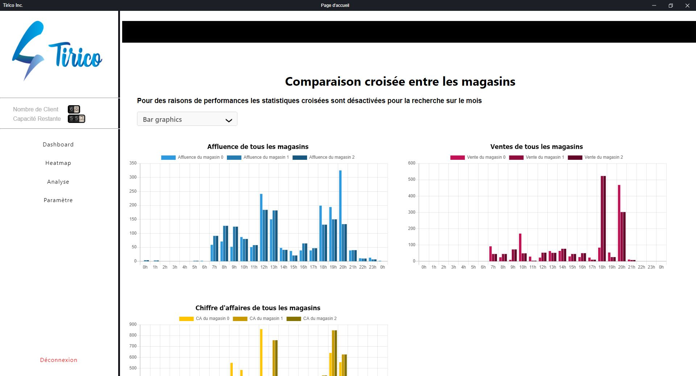
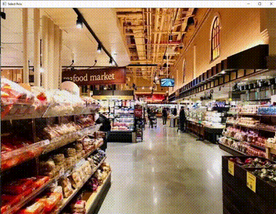

# Tirico-ShopCameraAnalytics

## Speech de Présentation 

Tirico est une application web d'aide à la décision pour tous les responsables et managers de magasin. Celle-ci permet, à partir de l'analyse d'image caméra, d'obtenir de précieuses informations, statistiques et graphiques sur le comportement client, permettant à vos gérants d'enseigne de prendre les meilleurs décisions sur l'aménagement des rayons. Notament sur le parcours client dans vos rayonnages, via par exemple des cartes de chaleurs, ou encore des graphiques sur le rapport entre le temps passé dans un rayon et l'argent dépensé à la caisse pour les produits de ce même rayon. Toutes nos études ont pour but de mettre en perspective la corrélation entre le comportement client analysé via nos caméra et l'analyse des tickets de caisse. Enfin des conseils générés par nos IA vous aident à mieux décrypter nos graphiques et vous proposes des initiatives possibles.

Afin de vous permettre de mieux cerner vos clients, et de vous permettre d'optimiser vos ventes !

Solution réalisé avec :
- **Electron** pour la partie applicative (html, css, js)
- **Tenserflow** pour la partie d'analyse d'image, de machine learning (avec du python en plus pour la partie IA)

---

## Table of Contents 

- **[Application](#application)**
- **[Installation](#installation)**
- **[Features](#features)**
- **[Team & Contact](#team)**
- **[Licences](#Licences)**

---
<a name='application'></a>
## Application

Retrouvez toutes les données sous forme de graphiques :
<p align="center"></p>

Sélection de zone de vente : 
<p align="center"></p>

Carte de chaleur des différentes zones en fonction de la popularité : 
<p align="center"></p>

## Demo of the tracker on Persons in the street
<p align="center"></p>

---
<a name='installation'></a>
## Installation

 Dans votre dossier d'installation, créez votre git et connectez le à ce repository : 
``` python
git init
git remote add origin https://github.com/VincentBernet/Tirico-ShopCameraAnalitics
git pull origin master
```
 
 Pour ensuite installer tous les composants nécessaires à l'application :
``` python
npm install
Installer dans Tirico_Server/code_python/data le fichier suivant : 
https://drive.google.com/open?id=1cewMfusmPjYWbrnuJRuKhPMwRe_b9PaT (yolov4.weights)
```

Pour lancer l'application :
``` javascript
npm start
```
 
Pour le python ~~(pas nécessaire actuellement, les graphes sont en locales)~~  
Installer pip ou anaconda pour installer plus facilement les librairies :

``` javascript
pip install pandas                         (pour réaliser les graphes)
pip install plotly                         (pour réaliser les graphes)
pip install -c plotly plotly-orca          (pour save en png les graphes)
pip install seaborn                        (pour réaliser la HeatMap)
```
Connexion Jeu de données: 
- Identifiant : vb@gmail.com | Mot de Passe : 123

---
<a name='features'></a>
## Features
On this application we implemetended multiples features such as :
 - Login/Register/Logout to acces at your account and your own shops's analytics.
 - Multiple analytics such as heatmap, client flow etc .
 
---
<a name='team'></a>
## Team & Contact

> This whole application is made by 7 students during their cursus in software Engenering at EFREI PARIS : <br> 

 - **[Jean Hecke](https://www.linkedin.com/in/jean-hecke-92060015b/)** & **[Louis Gailhac](https://www.linkedin.com/in/gailhac-louis/)** & **[Serge Nicolas Excoffier](https://www.linkedin.com/in/serge-excoffier/)**
 - **[Hélène Boersma](https://www.linkedin.com/in/h%C3%A9l%C3%A8ne-boersma-a0a16b17b/)** & **[Emeline Bagoris](https://www.linkedin.com/in/emeline-bagoris-116905142/)**
 - **[Sébastien Friedberg](https://www.linkedin.com/in/sebastien-friedberg/)** & **[Vincent Bernet](https://www.linkedin.com/in/vincent-bernet/)**

> Don't hesitate to contact us on Github or on Linkedin

---
<a name='Licences'></a>
## Licences

[](http://badges.mit-license.org)

- **[MIT license](http://opensource.org/licenses/mit-license.php)**
- Copyright 2021 © **[Tirico's Team](#team)**.
